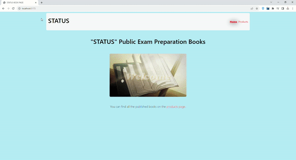

# Bookstore Website

A simple web application for browsing and searching books.

## About

The Bookstore Website is a web application that allows users to browse and search for books. Users can view details of each book, including the author, publication year, number of pages, and a brief description.

## Technologies Used

- [React]
- [Axios]
- [React Router DOM]
- [Json-server]
- [Bootstrap]

## Usage

- Visit the homepage to see a list of books.
- Use the search bar to search for books by name.
- Click on a book to view its details.

# Bookstore
